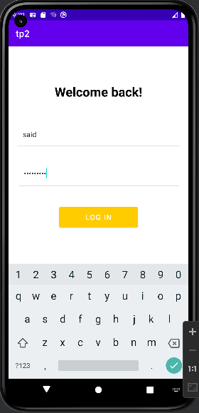

# ETTOUNANI_TP_MOBILE

<table>
 <tr>
      <td width="50%">
          <h3 align="center">Splash Screen</h3>
          

             
            

        </td>
	<td width="50%">
          <h3 align="center">Login Page</h3>
          

             
            

        </td>
</tr>

 <tr>
      <td width="50%">
          <h3 align="center">Home Page</h3>
          

             
            

        </td>
        <td width="50%">
          <h3 align="center">Strucure de Projet</h3>
          

             
            

        </td>
</tr>
</table>
<table>
<tr>
<td width="100%">
          <h3 align="center">Toast</h3>
          

             
            

        </td>
</tr>
<tr>
<td width="100%">
          <h3 align="center">Create Intent</h3>
          

             
            

        </td>
</tr>
<tr>
<td width="100%">
          <h3 align="center">Create Bundle</h3>
          

             
            

        </td>
</tr>

<tr>
<td width="100%">
          <h3 align="center">multilanguage support</h3>
          

             
            

        </td>
</tr>
<tr>
<td width="100%">
          <h3 align="center">Extract strings</h3>
          

             
            

        </td>
</tr>
</table>

tous les droits sont réservés by abderrahmane ettounani 